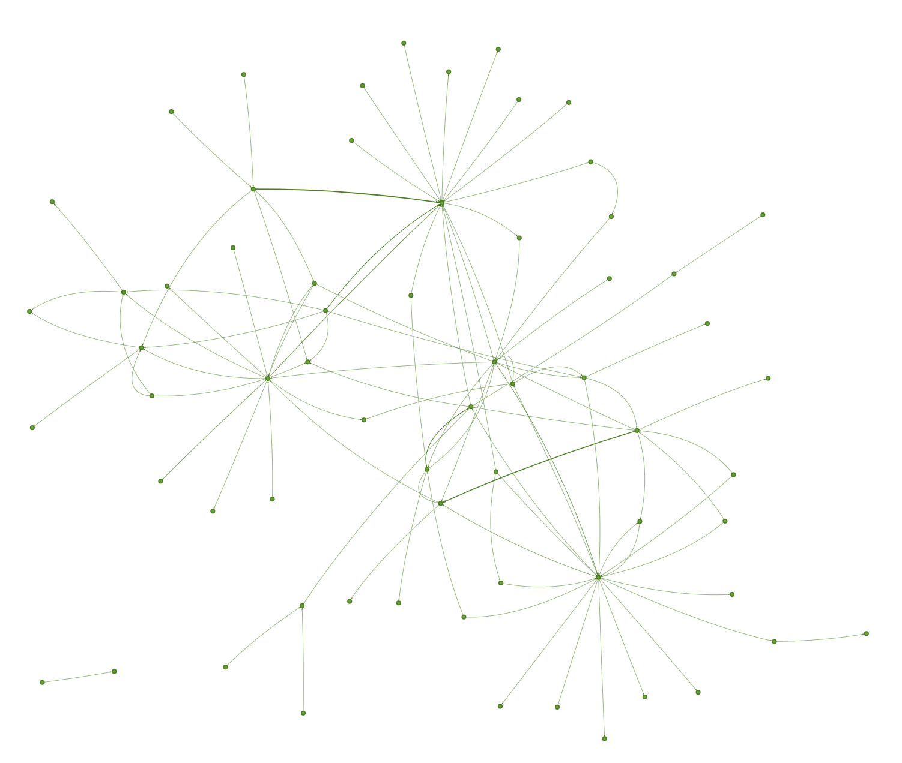
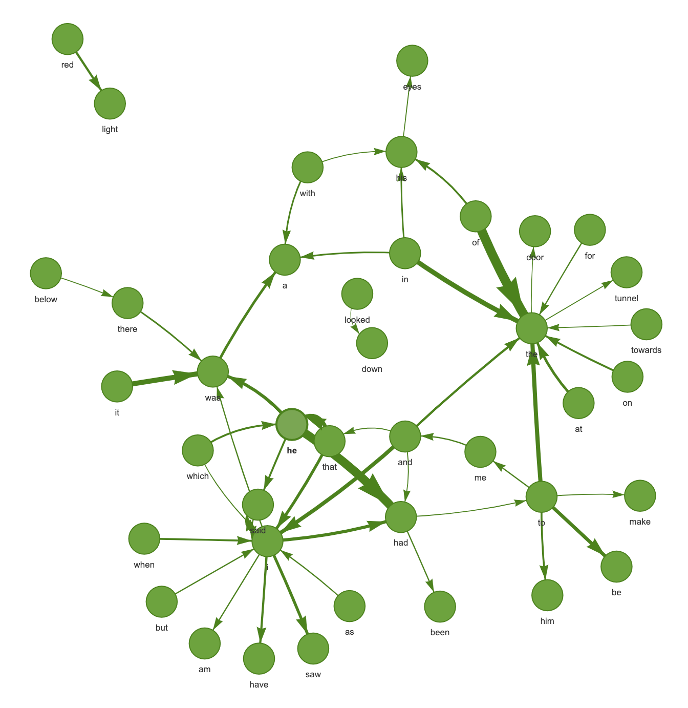
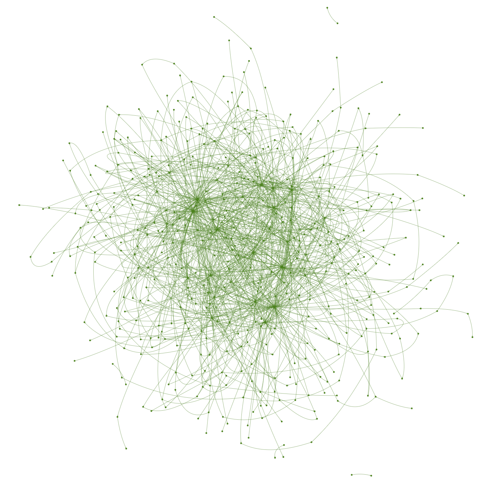
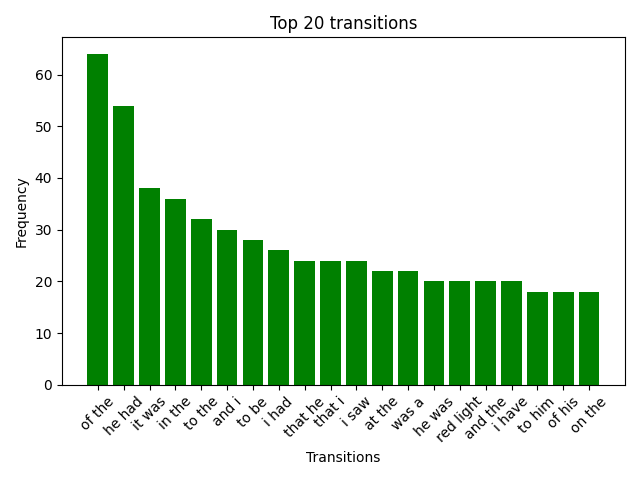

# NLP task for I.I. Mechnikova Programming Course

## Task Description

For this text https://www.online-literature.com/dickens/2941/

1. Count how many times the transition from one word to another occurred within sentences, and print the first 100 most
   common transitions.
2. Build a directed graph in SVG that shows transitions of words within a sentence. At each transition, indicate how
   many times the transition from the first word to the second occurred in the text (you may need to install the
   GraphViz package)
3. Generate 100 random sentences in the style of the selected text. Sentences must begin with a capitalized word and end
   with a period or an exclamation or question mark.
4. Optionally, make sure that the frequency of generated phrases corresponds to their frequency in the text.

## About

A tool is a class with options of pseudo generating text, displaying data in graph and bar variant.

## Getting started

### Requirements

* Python 3.10 +
* PIP package manager

### Setting Up

From the root directory create a new virtual environment, typically with

```shell
python3 -m venv venv
```

Get inside it:

```shell
source venv/bin/acticate
```

From directory of ```requirements.txt``` file (root of project), install dependencies:

```shell
pip install -r requirements.txt
```

### Run the app

Execute the ```main.py``` file

```shell
python3 -m src.main
```

All the results will be stored into ```results/``` directory

### Visualisation examples






### Text generation example

`Involuntarily I do there now showed you. Had he ought I know them on the sleeve across and display a conscientious man down and went out again and who had run wild misused his light. My good fellow what I had repeated my eyes on this appearance of it was near the lamp above him at the spot that the gallery atop of this time after the engine came down from that became calm the tunnel I had been when we were the army and saw a moment wondering at his comfort that they must do there any other I have not have made a repetition of him on. Admit those high stone that left him without any great dungeon the voice cry said I.`